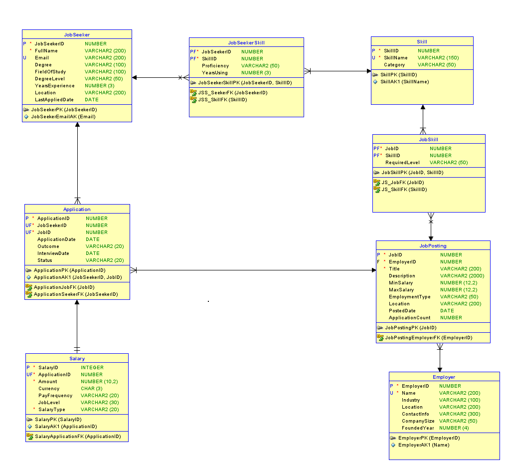

# Job Market & Salary Analytics

A relational SQL database project designed to support job market and salary analysis using synthetic data.

This project models relationships between job seekers, employers, job postings, skills, applications, and salary outcomes. It demonstrates relational database design, SQL constraints, triggers, views, and analytical queries in Oracle SQL.

## Project Goals

The project was designed to answer questions such as:

- Which skills are associated with higher salary offers?
- How does offered salary vary by degree level?
- How does salary vary across industries?
- Which industries attract the most job applications?

## Database Design

The database contains eight related tables:

- `JobSeeker`
- `Employer`
- `Skill`
- `JobPosting`
- `JobSeekerSkill`
- `JobSkill`
- `Application`
- `Salary`

The design uses primary keys, foreign keys, unique constraints, check constraints, and junction tables to represent relationships between job seekers, employers, skills, applications, and salary information.

## Relational Model

## SQL Features Demonstrated

### Database Constraints

The schema includes:

- Primary keys
- Foreign keys
- Unique constraints
- Check constraints
- Salary range validation
- Employment type validation
- Skill proficiency validation

### Triggers

Three Oracle SQL triggers were implemented:

1. `trg_application_count`  
   Automatically updates the number of applications associated with a job posting.

2. `trg_application_last_applied`  
   Updates a job seeker's most recent application date when a new application is submitted.

3. `trg_application_date_validate`  
   Prevents application dates from being entered in the future.

### Views

Two database views were created:

- `job_requirements` — combines job postings, employers, and required skills.
- `applications_with_salary` — combines application information with salary outcomes.

## Analytical Queries

The SQL analysis explores:

### Skills and Salary

Compares average offered salaries based on:

- Skills required by employers
- Skills possessed by job seekers

### Salary by Education

Calculates average offered salary by applicant degree level.

### Salary by Industry

Compares average offered salaries across employer industries.

### Application Activity

Identifies which industries receive the highest number of job applications.

## Technologies

- Oracle SQL
- SQL Developer
- Relational Database Design
- Data Modeling
- Data Analysis
- CSV Data

## Project Files

- [`final_project_DDL.sql`](final_project_DDL.sql) — database schema, constraints, triggers, views, and analytical queries
- [`Relational_1.png`](Relational_1.png) — relational database model
- `Application.csv`
- `Employer.csv`
- `JobPosting.csv`
- `JobSeeker.csv`
- `JobSeekerSkill.csv`
- `JobSkill.csv`
- `Salary.csv`
- `Skill.csv`

## Data

The dataset used in this project is **synthetic** and was created for academic database-design and analytics purposes. It does not represent actual job seekers, employers, or salary records.

## Key Skills Demonstrated

This project demonstrates my ability to:

- Design a normalized relational database
- Build relationships using primary and foreign keys
- Implement database validation rules
- Create Oracle SQL triggers
- Create reusable SQL views
- Write multi-table joins
- Perform salary and job-market analysis using SQL
- Translate business questions into database queries

## Author

**Olivia Nalwoga**  
MS Data Science  
University of St. Thomas
